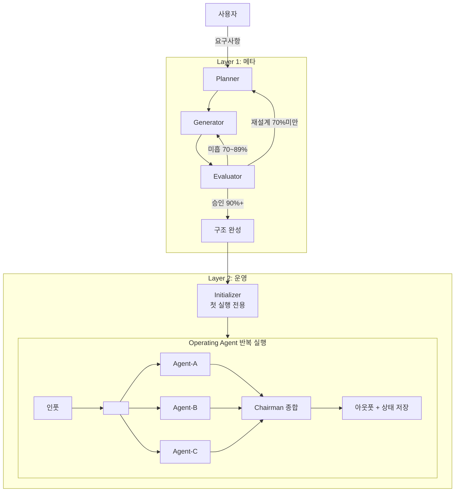

# Harness Designer v4

> 원칙: "에이전트에게 지도를 줘라, 1000페이지 매뉴얼 말고." — OpenAI Harness Engineering
> 원칙: "생성자가 자기 작업을 평가하게 하지 마라." — Anthropic GAN-Inspired Harness

## 하네스 설계 5대 기둥

이 스킬이 생성하는 모든 워크스페이스는 다음 5가지 기둥을 충족해야 한다:

| 기둥 | 핵심 질문 | 원칙 |
|------|----------|------|
| **Progressive Disclosure** | 에이전트가 필요한 것만 볼 수 있는가? | 목차(~100줄) → 포인터 → 깊은 문서 |
| **Mechanical Enforcement** | 규칙이 기계적으로 강제되는가? | 문서화만으로는 일관성 유지 불가 |
| **Feedback Loop** | 실패 시 구조적 개선이 가능한가? | "더 열심히"가 아닌 "어떤 능력이 빠졌는가" |
| **Session Continuity** | 세션 간 핸드오프가 깨끗한가? | progress + feature-status + git |
| **Entropy Management** | 시간이 지나도 구조가 유지되는가? | 주기적 정리, 문서 신선도 검증 |

---

## 두 레이어의 관계

```
┌─────────────────────────────────────────────────────┐
│  LAYER 1: 메타 (이 스킬의 역할)                       │
│                                                     │
│  Planner ──→ Generator ──→ Evaluator                │
│     ↑         (단방향 순차, 역참조 금지)          │
│     └──── 미흡 시 피드백 ──────────────────────┘    │
│                                                     │
│  목적: 워크스페이스 구조 자체를 설계·생성·검증          │
└─────────────────────────┬───────────────────────────┘
                          │ 승인 후 구조 완성
                          ▼
┌─────────────────────────────────────────────────────┐
│  LAYER 2: 운영 (완성된 워크스페이스의 역할)             │
│                                                     │
│  ┌ Initializer (첫 실행 전용) ─→ 환경 설정           │
│  │                                                  │
│  └ Operating Agent (반복 실행):                      │
│    Agent-A ─┐                                       │
│    Agent-B ─┼──→ Chairman 종합 ──→ 최종 산출물       │
│    Agent-C ─┘  (독립 병렬, 서로 교류 없음)            │
│                                                     │
│  목적: 실제 업무 수행 (분석, 의사결정, 보고서 등)        │
└─────────────────────────────────────────────────────┘
```

---

# LAYER 1: 메타 — 하네스 설계 프로세스

## L1 에이전트 3종 (단방향 순차, 역참조 금지)

Planner → Generator → Evaluator 순으로 산출물이 전달된다.
각 에이전트는 이전 단계의 산출물만 받고, 다음 단계 결과를 미리 보지 않는다.

### Planner (기획 에이전트)
사용자 의도를 분석해서 하네스 구조를 설계한다.
- 인풋: 사용자 요구사항 (질문을 통해 수집)
- 아웃풋: 에이전트 구성안 + 폴더 구조 초안 + 평가 기준 제안
- 제약: Generator·Evaluator 결과를 보기 전에 설계한다

### Generator (구축 에이전트)
Planner 설계안을 실제 파일로 만든다.
- 인풋: Planner 승인된 설계안
- 아웃풋: 실제 .md/.json 파일들 (전체 산출물 목록은 Phase 2 참조)
- 제약: Evaluator 기준을 미리 보지 않고 구축한다

### Evaluator (평가 에이전트)
Generator 산출물을 독립적으로 검증한다.
- 인풋: Generator 생성 파일 + Planner 평가 기준
- 아웃풋: 5대 기둥 기반 점수 + 기능적 검증 결과 + 개선 피드백
- 제약: Generator 의도를 고려하지 않고 결과물만 본다

---

## L1 Phase 1: Discovery — Planner 작동

Discovery는 4단계 질문으로 구성된다.
각 단계를 순서대로 진행하되, 사용자 답변에 따라 후속 질문이 분기된다.
**한 단계의 답변을 받은 후 다음 단계로 넘어간다.** 한꺼번에 묻지 않는다.

### 1-1. Stage 1 — 목적과 맥락 (WHY / WHO)

> 구조가 아닌, 이 워크스페이스가 존재하는 이유를 파악한다.

```
W1. 이 워크스페이스가 해결하려는 문제는 무엇인가?
    (어떤 의사결정/분석/판단이 지금 잘 안 되고 있는가?)

W2. 누가 사용하는가?
    (에이전트만 / 에이전트+사람 / 사람이 결과를 소비)
    → 후속: 사용자의 도메인 전문성 수준은?

W3. 이 워크스페이스의 성공 기준은?
    (어떤 결과가 나오면 "잘 만들었다"고 할 수 있는가?)

W4. 비슷한 기존 프로세스가 있는가?
    (대체하는 것인가 / 새로 만드는 것인가)
    → 후속 [대체]: 기존 프로세스의 가장 큰 문제점은?
    → 후속 [신규]: 벤치마크하는 시스템이 있는가?
```

**후속 질문 분기:**
- W2에서 "사람이 결과 소비" → "결과를 받는 사람의 직급/역할은? 어떤 형식을 선호?"
- W3에서 모호한 답변 → "구체적으로 어떤 산출물이 나오면 성공인가?"

### 1-2. Stage 2 — 산출물과 구조 (WHAT)

> 무엇을 만드는가, 어떤 관점이 필요한가.

```
S1. 최종 산출물은?
    (보고서 / 의사결정 기록 / 분석 리포트 / 기획안)

S2. 반복되는 핵심 작업 패턴은?
    (인풋 → 분석 → 의사결정 → 기록 → 지식 축적)

S3. 필요한 관점·역할은 몇 가지? 각각 어떤 성격?
    (예: 낙관/비관/데이터/경험/규제 — 서로 충돌·보완)
    → 후속: 관점 간 우선순위가 있는가? 동등한가?

S4. Chairman(종합 역할)이 필요한가?
    (메인 세션 담당 / 별도 에이전트 / 불필요)
    → 후속 [필요]: 에이전트 모델 구성은?
      → references/agent-archetypes.md 참조 후 제안

S5. 인풋 형태는?
    (텍스트 직접 입력 / 파일 업로드 / URL / 복합)

S6. 남아야 할 아웃풋은?
    (세션 파일 / 의사결정 기록 / 지식 축적 / deep-research)
```

**후속 질문 분기:**
- S3에서 5개 이상 관점 → "이 관점들을 그룹으로 묶을 수 있는가? 순차 vs 병렬?"
- S4에서 "별도 에이전트" → "Chairman의 판단 프레임워크는? Go/Pivot/No-Go?"

### 1-3. Stage 3 — 환경과 도구 (HOW)

> 어떤 환경에서 어떻게 운영할 것인가.

```
H1. 사용하는 AI 도구는?
    (Claude Code / Desktop Claude / 기타)
    → 도구에 따라 하네스 설정 방식이 다름

H2. 세션 간 연속성이 필요한가?
    (단발 분석 / 장기 프로젝트 / 멀티 세션)
    → "장기"라면 세션 핸드오프 산출물 포함

H3. 에이전트 모델 구성은?
    → 웹 검색으로 현재 최신 Claude 모델을 확인 후 제안
    → 모델명을 하드코딩하지 않는다. 항상 사용자가 결정

H4. 에이전트의 자율성 수준은?
    (사람이 매번 확인 / 에이전트 자율 판단 + 보고 / 완전 자율)
```

**후속 질문 분기:**
- H2에서 "장기" → "예상 세션 수는? 지식 축적이 중요한가?"
- H4에서 "완전 자율" → "에스컬레이션 기준은? 어떤 상황에서 사람에게 물어야 하는가?"

### 1-4. Stage 4 — 품질과 평가 기준 (QUALITY / EVALUATE)

> 사용자가 중요하게 생각하는 가치를 파악하고, 평가 기준을 합의한다.

```
E1. 이 워크스페이스에서 가장 중요한 품질 속성은? (상위 3개 선택)
    □ 분석 깊이 (표면적이지 않은 통찰)
    □ 독립성 (에이전트 간 영향 없는 독립 분석)
    □ 출처 명시 (근거 기반 결론)
    □ 일관성 (세션 간 품질 유지)
    □ 빠른 반응 (짧은 처리 시간)
    □ 확장성 (에이전트/역할 추가 용이)
    □ 문서화 (과정과 결과의 추적 가능성)
    □ 사용자 접근성 (비전문가도 결과 이해)

E2. 향후 확장 계획이 있는가?
    (없음 / 관점 추가 / 다른 도메인 적용 / 자동화 강화)

E3. 이 워크스페이스에서 절대 타협하면 안 되는 것은?
    (예: "에이전트가 서로 영향을 주면 안 된다", "출처 없는 결론은 안 된다")

E4. 반대로, 초기에는 없어도 괜찮은 것은?
```

**후속 질문 분기:**
- E1에서 "독립성" → "어떤 수준? 결과 공유도 금지? 아니면 분석만 독립?"
- E3의 답변 → Evaluator 가중치의 핵심 입력으로 사용

### 1-5. 평가 가중치 합의 (Stage 4 완료 후)

Stage 1~4의 답변을 분석하여 **5대 기둥의 가중치를 제안**한다.
사용자와 합의하여 최종 확정한다.

```
[가중치 제안 프로세스]

STEP 1. Stage 1~4 답변에서 키워드 추출
  - "독립성 필수" → Mechanical Enforcement ↑
  - "장기 프로젝트" → Session Continuity ↑, Entropy Management ↑
  - "빠른 반응" → Progressive Disclosure ↑
  - "출처 명시" → Mechanical Enforcement ↑

STEP 2. 기본 가중치에서 조정하여 제안

  기본 가중치 (프로젝트 특성 반영 전):
  | 기둥 | 기본 | 조정 근거 | 제안 |
  |------|------|----------|------|
  | Progressive Disclosure | 20% | (변동 근거) | ?% |
  | Mechanical Enforcement | 25% | (변동 근거) | ?% |
  | Feedback Loop | 20% | (변동 근거) | ?% |
  | Session Continuity | 15% | (변동 근거) | ?% |
  | Entropy Management | 20% | (변동 근거) | ?% |

  "이 프로젝트에서는 [근거]를 고려하여
   [기둥]의 가중치를 [기본]% → [제안]%로 조정했습니다.
   의견이나 수정 사항이 있으시면 말씀해주세요."

STEP 3. 사용자 피드백 반영
  - 동의 → 확정
  - "독립성을 더 높여줘" → Mechanical Enforcement 상향, 다른 기둥 하향 후 재제안

STEP 4. 최종 승인
  → evaluator-protocol-workspace.md의 기본 가중치 대신 합의된 가중치를 사용
```

### 1-6. 패턴 자동 매핑

Stage 2 답변으로 폴더 패턴을 자동 추천한다:

| 사용자 답변 키워드 | 추천 패턴 | 참조 |
|------------------|----------|------|
| 분석, 투자, 의사결정, 판단 | 패턴 A (분석·의사결정형) | folder-patterns.md |
| 시공, 공정, 내역서, 건설 | 패턴 B (건설·프로젝트관리형) | folder-patterns.md |
| 리서치, 콘텐츠, 보고서 | 패턴 C (리서치·콘텐츠형) | folder-patterns.md |
| 장기 코딩, 자동화 빌드 | 패턴 D (장기 에이전트형) | folder-patterns.md |

### 1-7. Planner 산출물

**① 프로젝트 컨텍스트 요약** — 목적, 사용자, 성공 기준, 핵심 제약 (Stage 1~2 기반)
**② 에이전트 구성안** — 역할, 성격, 모델 배치
**③ 폴더 구조 초안** — 패턴 매핑 + 커스터마이징
**④ 세션 연속성 설계** — 핸드오프 방식 결정 (단발 / progress.json 사용)
**⑤ 확장 전략** — 향후 확장에 대비한 설계 결정 (Stage 4 E2 기반)
**⑥ 평가 기준 + 합의된 가중치** — 5대 기둥 체크리스트 + 가중치 테이블

```
[Planner 완료 — 사용자 승인 요청]
①~⑥을 검토 후 수정 사항 말씀해주세요.
승인되면 Generator가 구축을 시작합니다.
```

---

## L1 Phase 2: Build — Generator 작동

Planner 산출물 승인 후 아래 순서로 파일 생성.
Generator는 **폴더 구조 + 파일 내용물 모두** 생성한다.

### 2-1. 워크플로우 다이어그램 (Mermaid)

두 레이어를 모두 표현하는 다이어그램. Evaluator→Planner 재설계 루프 포함:



### 2-2. 핵심 산출물 생성 (순서대로)

| 순번 | 산출물 | 참조 파일 | 비고 |
|------|--------|----------|------|
| 2-2a | WORKSPACE_TREE.md | folder-patterns.md | 폴더 구조 확정 |
| 2-2b | CLAUDE.md (~100줄) | claude-md-template.md | **목차 역할**, 참조 라우팅 테이블 필수 |
| 2-2c | AGENTS.md | (본 스킬 내 가이드) | 에이전트 운영 규칙 + model_config |
| 2-2d | 에이전트 역할 파일 | agent-archetypes.md | 00-system/prompts/*.md |
| 2-2e | 프로토콜 5종 | (본 스킬 내 가이드) | 00-system/protocols/ |
| 2-2f | 세션 핸드오프 산출물 | session-handoff.md | progress.json + feature-status.json |
| 2-2g | 강제 규칙 | enforcement-patterns.md | 구조 검증 가능한 규칙 |
| 2-2h | 슬래시 커맨드 | (Planner 설계 기반) | .claude/commands/*.md |
| 2-2i | README.md | (사용자 가이드) | 빠른 시작 + 커맨드 + 트러블슈팅 |

### 2-2b. CLAUDE.md 작성 규칙 (최중요)

→ `references/claude-md-template.md` 참조. **반드시 100줄 이내.**

CLAUDE.md는 에이전트의 **진입점(entry point)**이다.
너무 긴 instruction은 "비안내(non-guidance)"가 된다:
- 컨텍스트가 작업과 코드를 밀어낸다
- 에이전트가 의도적 탐색 대신 로컬 패턴 매칭에 빠진다
- 모놀리식 문서는 즉시 낡는다

**반드시 포함하는 것:**
- 워크스페이스 정체성 (3줄)
- 에이전트 구성 테이블
- **참조 라우팅 테이블** ← Progressive Disclosure 핵심
- 독립성 원칙 포인터
- 커맨드 목록

**참조 라우팅 테이블 형식:**
```markdown
## 참조 라우팅
| 상황 | 읽을 파일 |
|------|----------|
| 에이전트 역할 확인 | → 00-system/prompts/[role].md |
| 토론 진행 규칙 | → 00-system/protocols/council-protocol.md |
| 독립성 원칙 상세 | → 00-system/protocols/independence-protocol.md |
| 세션 상태 확인 | → progress.json |
| 기능 완료 현황 | → feature-status.json |
```

### 2-2c. AGENTS.md 작성 규칙

**반드시 포함:**
- Layer 2 에이전트 목록 테이블 (역할 / 모델 / 활성화 조건)
- model_config 섹션 (사용자 선택 모델 + 재검토 트리거)
- Chairman 종합 방식 + 결정 프레임워크 (Go/Pivot/No-Go)
- 독립성 원칙 요약
- 컨텍스트 관리 규칙

### 2-2d. 에이전트 역할 파일

각 `00-system/prompts/[role].md`:
→ `references/agent-archetypes.md` 참조
- 정체성, 독립성 선언(포인터), 관점, 분석 프로세스, 절대 금지

> **아웃풋 형식 정본 규칙 (Source of Truth)**:
> - `00-system/templates/*.md`가 아웃풋 구조의 **정본(source of truth)**이다.
> - 에이전트 프롬프트(`prompts/*.md`)에는 아웃풋 형식을 **인라인하지 않는다**.
>   대신 `아웃풋 형식: → 00-system/templates/[해당-template].md 참조` 포인터를 둔다.
> - 에이전트별로 템플릿 필드가 다른 경우, 범용 템플릿 대신 에이전트별 템플릿을 분리한다.
>   (예: research-template.md를 academic/trend/product별로 분리)
> - **이유**: 프롬프트와 템플릿 양쪽에 동일 구조를 두면 수정 시 drift가 발생한다.

### 2-2e. 프로토콜 5종

```
00-system/protocols/
├── council-protocol.md        ← 에이전트 소집·진행·종합 규칙
├── independence-protocol.md   ← 독립성 보장 규칙 (필수)
├── analysis-protocol.md       ← 분석 표준 절차
├── data-pipeline-architecture.md ← 데이터 흐름 설계
└── maintenance-protocol.md    ← 엔트로피 관리 (v4 신규)
```

**maintenance-protocol.md 필수 내용:**
- 문서 신선도 검증 주기 (N회 세션마다 / 새 에이전트 추가 시)
- CLAUDE.md ↔ WORKSPACE_TREE.md 동기화 체크
- 오래된 세션 파일의 아카이브 기준 (90-archive/ 이동 조건)
- 하네스 경량화 검토 (아래 참조)

### 2-2f. 세션 핸드오프 산출물

→ `references/session-handoff.md` 참조

장기 프로젝트 시 Generator가 생성해야 하는 운영 상태 파일:

**progress.json** — 현재 작업 상태
```json
{
  "last_session": "2026-03-29T10:00:00",
  "last_completed": "지역 분석 — 수원 영통구",
  "next_todo": "비교 분석 — 동탄 vs 광교",
  "open_issues": [],
  "session_count": 5
}
```

**feature-status.json** — 기능 완료 현황 (JSON, Markdown 아님)
```json
[
  {"id": "F001", "description": "Council 5인 독립 토론", "passes": true},
  {"id": "F002", "description": "비교 분석 자동 저장", "passes": false},
  {"id": "F003", "description": "인사이트 CARL 형식 축적", "passes": false}
]
```

JSON을 사용하는 이유: 에이전트가 Markdown보다 JSON을 부적절하게 편집할 가능성이 낮다 (Anthropic 원안).

### 2-2g. 강제 규칙 (Mechanical Enforcement)

→ `references/enforcement-patterns.md` 참조

문서화만으로는 일관성 유지 불가. Generator는 규칙을 **검증 가능한 형태**로 만든다:

| 규칙 유형 | 문서만 | 강제 가능 (v4) |
|----------|--------|---------------|
| 독립성 원칙 | "동조 금지" 선언 | 세션 기록에 `bias_check` 필드 포함 |
| 출처 필수 | "출처 없는 주장 금지" | 아웃풋 템플릿에 `source` 필드 필수 |
| 파일 구조 | WORKSPACE_TREE.md | 구조 검증 스크립트 (선택) |
| 세션 상태 | 없음 | progress.json 업데이트 의무 |

### 2-2h~i. 슬래시 커맨드 + README.md

**커맨드:** Planner 설계에서 도출된 주요 워크플로우를 .claude/commands/*.md로 생성
**README.md:** 사용자 가이드 — 빠른 시작, 핵심 기능, 커맨드 레퍼런스, 트러블슈팅

```
[GATE: Generator → Evaluator 강제 전환]
이 절차는 건너뛸 수 없다. Generator 완료 즉시 실행한다.

STEP 1. 산출물 존재 확인
  아래 각각에 대해 Glob으로 존재 + Read로 비어있지 않음을 확인한다:
  □ CLAUDE.md (~100줄)
  □ AGENTS.md
  □ WORKSPACE_TREE.md
  □ 00-system/prompts/ 내 에이전트 역할 파일 1개 이상
  □ 00-system/protocols/council-protocol.md
  □ 00-system/protocols/independence-protocol.md
  □ 00-system/protocols/maintenance-protocol.md
  □ .claude/commands/ 내 커맨드 파일 1개 이상
  □ README.md
  □ (장기 프로젝트) progress.json + feature-status.json

  → 미존재 파일이 있으면: Generator로 돌아가서 해당 파일만 생성
  → 모두 존재하면: STEP 2로 진행

STEP 2. Evaluator 프로토콜 실행
  → references/evaluator-protocol-workspace.md 를 읽고 그 절차를 그대로 실행한다
  → 5대 기둥 × 3항목 = 15항목 채점
  → 가중치 적용 → 총점 산출
  → 결과를 보고 형식으로 사용자에게 출력

STEP 3. 점수별 분기
  → 90점 이상: Layer 2 전환 승인
  → 70~89점: Generator 재작업 (STEP 4)
  → 70점 미만: Planner 재설계 (Phase 1로 복귀)

이 GATE를 통과하지 않으면 Layer 2로 진행할 수 없다.
```

---

## L1 Phase 3: Evaluate — Evaluator 작동

> 이 단계는 GATE에 의해 자동으로 진입한다. 생략할 수 없다.

### 3-1. 검증 실행

→ `references/evaluator-protocol-workspace.md` 를 읽고 그대로 실행한다.

요약: 5대 기둥 × 3항목 = 15항목을 PASS/PARTIAL/FAIL로 채점.
가중치 적용 후 100점 만점으로 총점 산출. 결과를 보고 형식으로 출력.

### 3-2. 피드백 루프 (점수별 분기)

| 총점 | 판정 | 구체적 행동 |
|------|------|------------|
| 90점+ | **PASS** | Layer 2 구조 토론 → 사용자 최종 승인 → 구조 확정 |
| 70~89점 | **REWORK** | FAIL/PARTIAL 항목별 피드백 → Generator 재작업 → Evaluator 재실행 |
| 70점 미만 | **REDESIGN** | 근본 원인 분석 → Planner 재설계 |

### 3-3. 재검증 규칙

1. Generator 재작업 후 **Evaluator 전체 재실행** (부분 검증 금지)
2. 최대 **3회 반복**. 초과 시 사용자에게 에스컬레이션
3. 매 반복마다 점수 변화 테이블 보고
4. 3회 연속 점수 개선 없으면 → 즉시 사용자 에스컬레이션 (무한 루프 방지)

### 3-4. REWORK 피드백 형식

각 FAIL/PARTIAL 항목에 대해:

```
❌ [기둥명] 항목 [번호]: [FAIL/PARTIAL]
   문제: [무엇이 부족한지 1줄]
   수정: [구체적으로 어떤 파일에 무엇을 추가/변경할지]
```

이 피드백은 Generator가 그대로 따라 실행할 수 있는 수준이어야 한다.

### 3-5. Layer 2 구조 최종 토론 (PASS 판정 후)

Evaluator 통과 후, 완성된 구조를 Layer 2 에이전트들이 검토·토론.
각 에이전트가 자신의 관점에서 구조를 평가한 뒤, Chairman이 종합.

### 3-6. 하네스 경량화 검토 (PASS 판정 후)

```
[경량화 체크리스트]
- [ ] 이 프로토콜 중 현재 모델이 자체 처리할 수 있는 것은?
- [ ] 프로토콜 5종 중 이 도메인에 불필요한 것은?
- [ ] 에이전트 수가 과잉이지 않은가? (8개 초과 비권장)
- [ ] 세션 핸드오프가 불필요한 단발 프로젝트인데 추가되지 않았는가?
```

> 원칙: 모델이 좋아질수록 하네스는 단순해져야 한다. (Anthropic)

사용자 최종 승인 후 구조 확정:
```
[Layer 1 완료 — 구조 확정]
이 시점부터 워크스페이스는 Layer 2로 전환됩니다.
이후 모든 작업은 완성된 하네스 안에서 도메인 에이전트들이 수행합니다.
```

---

# LAYER 2: 운영 — 완성된 워크스페이스

Layer 1이 완료된 이후의 동작 방식.
이 스킬은 Layer 2를 직접 실행하지 않는다.
Layer 2는 생성된 CLAUDE.md + AGENTS.md가 정의한다.

## Initializer / Operating Agent 분리 (v4 핵심)

→ `references/session-handoff.md` 참조

**Initializer (첫 실행 전용):**
- 개발 서버 시작 스크립트 설정 (해당 시)
- progress.json 초기화
- feature-status.json 생성 (기능 목록 전개)
- 초기 git commit
- 기본 동작 테스트

**Operating Agent (매 세션 반복):**
```
1. progress.json 읽기 → 현재 상태 파악
2. feature-status.json 확인 → 다음 작업 선택
3. 작업 하나 수행 (점진적 진행)
4. 결과 검증 (자기 검증 또는 별도 Evaluator)
5. clean state로 저장:
   - progress.json 업데이트
   - feature-status.json 상태 변경
   - git commit (해당 시)
   - 세션 기록 저장 (30-analysis/sessions/)
```

## Layer 2 기본 흐름 (Council 모드)

```
사용자 인풋
    │
    ▼
[독립 에이전트들 — 서로 교류 없음, 병렬 실행]
  Agent-A → 관점 A 분석
  Agent-B → 관점 B 분석
  Agent-C → 관점 C 분석
    │
    ▼
[Chairman — 메인 세션]
  모든 결과 수집 → 종합 → 판정
  (Go / Pivot / No-Go / 추가 분석)
    │
    ▼
[아웃풋 + 상태 저장]
  세션 파일 → 30-analysis/sessions/
  의사결정  → 50-decisions/
  교훈 축적 → 70-playbook/ (CARL 형식)
  지식 발견 → 40-knowledge-index/
  진행 상태 → progress.json 업데이트
```

## Layer 2 지식 순환 (CARL 형식)

→ `references/carl-format.md` 참조

```
[현재 케이스 분석]
        ↓
[세션 파일 저장]
        ↓
[교훈 추출 → 70-playbook/ CARL 형식]
  Context: 어떤 상황이었나
  Action: 무슨 판단/행동을 했나
  Result: 결과가 어떠했나
  Learning: 무엇을 배웠나
        ↓
[다음 케이스에서 자동 참조]
```

---

## 참조 파일

| 파일 | 언제 읽는가 |
|------|-----------|
| `references/agent-archetypes.md` | Phase 1에서 에이전트 구성 설계 시 |
| `references/folder-patterns.md` | Phase 1에서 폴더 구조 선택 시 |
| `references/claude-md-template.md` | Phase 2에서 CLAUDE.md 생성 시 |
| `references/session-handoff.md` | Phase 2에서 세션 핸드오프 설계 시 |
| `references/enforcement-patterns.md` | Phase 2에서 강제 규칙 설계 시 |
| `references/carl-format.md` | Phase 2에서 playbook 구조 설계 시 |
| `references/evaluator-protocol-workspace.md` | **Phase 3 GATE에서 자동 로드** — 5대 기둥 채점 실행 |
